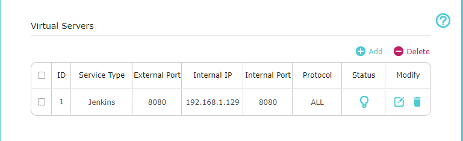
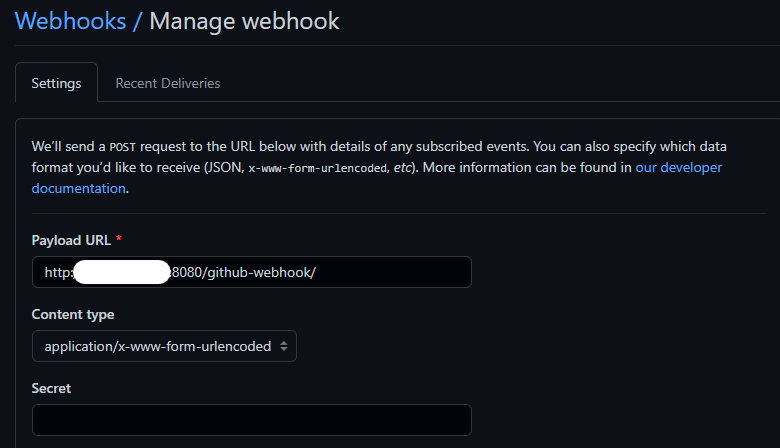
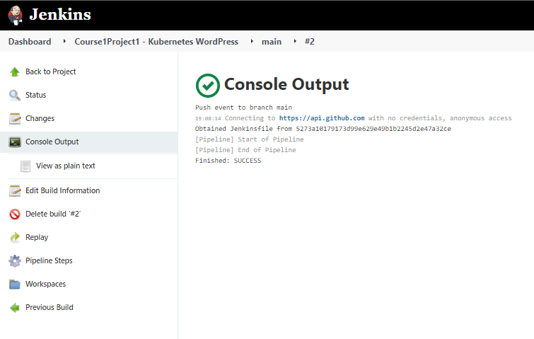

# DevOpsK8sWordPress
This is project 1 in course 1 of the CalTech DevOps post-graduate certificate program

## System configuration

### Environement
  * 2 Ubuntu 20.04.3 LTS VMs running on HyperV hypervisor
    - devops (192.168.1.129)
    - devops2 (192.168.1.130)
  * K3s single node running on devops2
  * Jenkins running on devops
  * Personal Repository hosted at https://github.com/RedOneLima/DevOpsK8sWordPress

## Jenkins configuration
  * Multi-stage pipeline project with GitHub source

  * Added port forwarding on my router and pointed the github webhook at my public IP

  * Added webhook into my github repo to trigger remote build

### Test configuration

