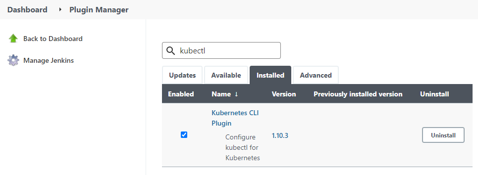
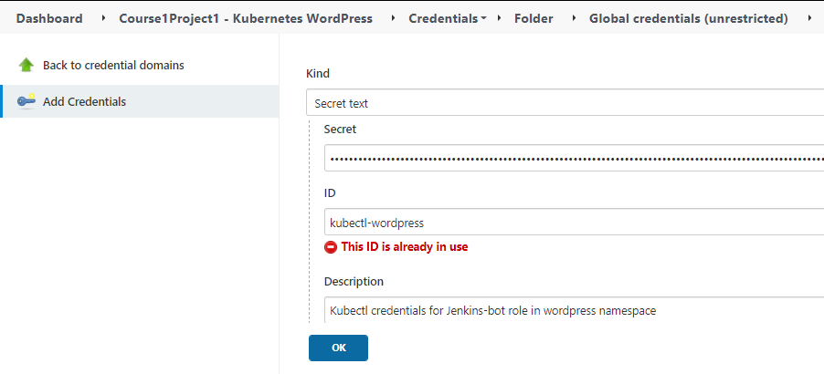

# DevOpsK8s WordPress
This is project 1 in course 1 of the CalTech DevOps post-graduate certificate program

## System configuration

### Environement
  * 3 Ubuntu 20.04.3 LTS VMs running on HyperV hypervisor
    - devops (192.168.1.129)
    - devops2 (192.168.1.130)
    - k8sworker1 (192.168.1.133)
  * K3s 2 node running on devops2 and k8sworker1
  * Jenkins running on devops
  * Personal Repository hosted at https://github.com/RedOneLima/DevOpsK8sWordPress

## Create K3s cluster

* On the master node, run the Rancher K3s script (devops2)

```bash
curl -sfL https://get.k3s.io | sh -
```

* Once this is set up, we can get the token to join nodes to the new cluster by copying `/var/lib/rancher/k3s/server/node-token`

* From the worker node, we're going to run the same script, however we're going to add some additional options to make it join the cluster instead of starting a new control plane

```bash
#I've set the contents of /var/lib/rancher/k3s/server/node-token on the master node as $mynodetoken

$ curl -sfL https://get.k3s.io | K3S_URL=https://devops2:6443 K3S_TOKEN=$mynodetoken sh -
```

* From the master node, we're going to move the kubectl configuration to the default location to be able to run kubectl without using the k3s command

```bash
$ mkdir ~/.kube
$ sudo cp /etc/rancher/k3s/k3s.yaml ~/.kube/config
```

* Now we can check if the nodes are connected and ready

```bash
$ kubectl get nodes

NAME          STATUS   ROLES                  AGE   VERSION
k8sworker01   Ready    <none>                 12d   v1.22.5+k3s1
devops2       Ready    control-plane,master   12d   v1.22.5+k3s1
```

* Finally, we want to copy the kubectl configuration over to devops so that we don't have to run kubectl on any of the cluster nodes. This will help identify connectivity issues that are masked by using a localhost configuration. 

```bash
# From devops2
scp ~/.kube/config devops:~/.kube/config
```

* We need to point that configuration at the master node in the config file since by default its going to be localhost

```bash
# From devops change localhost to devops2 for server:
$ vim ~/.kube/config

...
server: https://devops2:6443
...
```

* Run get nodes from devops to make sure there's connectivity to cluster

```
$ kubectl get nodes

NAME          STATUS   ROLES                  AGE   VERSION
k8sworker01   Ready    <none>                 12d   v1.22.5+k3s1
devops2       Ready    control-plane,master   12d   v1.22.5+k3s1
```

### K8s Configuration for Jenkins

* For Jenkins to be able to send commands to the cluster, a service account and cluster role binding and generating secrets for the Jenkins host

```bash
$ kubectl -n <namespace> create serviceaccount jenkins-robot

$ kubectl -n <namespace> create rolebinding jenkins-robot-binding --clusterrole=cluster-admin --serviceaccount=<namespace>:jenkins-robot

$ kubectl -n <namespace> get serviceaccount jenkins-robot -o go-template --template='{{range .secrets}}{{.name}}{{"\n"}}{{end}}'

jenkins-robot-token-d6d8z

# Retrieve the token and decode it using base64.
$ kubectl -n <namespace> get secrets jenkins-robot-token-d6d8z -o go-template --template '{{index .data "token"}}' | base64 -d

eyJhbGciOiJSUzI1NiIsImtpZCI6IiJ9.eyJpc3MiOiJrdWJlcm5ldGVzL3NlcnZpY2V[...]
```

* Save this token for the Jenkins configuration

## Jenkins configuration
  * Multi-stage pipeline project with GitHub source


  * Added port forwarding on my router and pointed the github webhook at my public IP


  * Added webhook into my github repo to trigger remote build


### Test configuration

* We know this was successful because the console output shows `Push event to branch main` showing that it was a webhook triggered from a push that triggered the build


### Kubectl Plugin Configuration

* Install the kubernetes plugin into Jenkins from the marketplace



* Configure the credential needed to access cluster
  * This is the secret from the [K8s secret](#k8s-configuration-for jenkins)



## Create the Jenkinsfile

* The objective of the Jenkinsfile is to deploy the kubernetes manifests to the cluster on build

```Jenkinsfile
pipeline {
   agent any
    
   stages {
      
      // Execute when branch = 'main'
      stage("Main Branch deployment") {
        when {
		      branch 'main'
        }
         steps {
            withKubeConfig([
               credentialsId: 'kubectl-wordpress', 
               serverUrl: 'https://devops2:6443',
               namespace: 'wordpress'
               ]) {
               sh 'kubectl apply -f ./kubernetes'
            }
         }
      }
  
   }
}
```
* There's a single stage with the name `"Main Branch Deployment"`
  * This only runs when on the main branch becaues of the block
    ```Jenkinsfile
    when {
      branch 'main'
    }
    ```
* This uses the kubectl plugin which allow us to use `withKubeConfig`
  * We pass in the server's URL, the namespace (this is important because our binding is only within the wordpress namespace) and the credential for our Jenkins' service secret. 
  * This sets the context that would normally be set in ~/.kube/config to allow us to run kubectl commands the same way we've been doing from the cli.
* Finally, we call apply on everything within the `kubernetes` directory which is where our `wordpress` and `mariadb` workload manifests are. 

## Testing workflow

